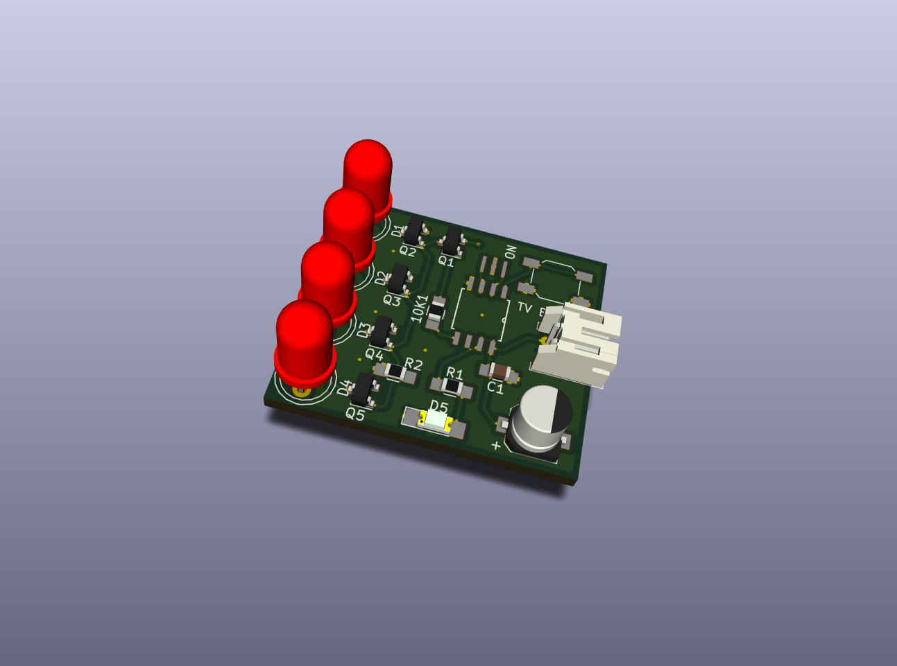
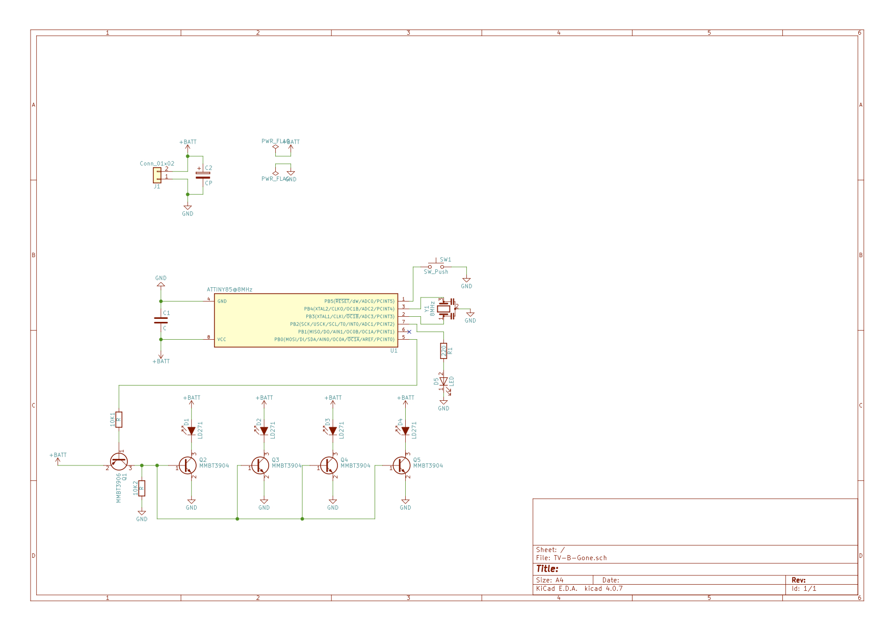

# tv-b-gone-smd
The TV B Gone circuit as smd version and using the Arduino IDE for compiling

Ken Shirriff ported the original code of the tv-b-gone for using the Ardunio and the Ardunio IDE.

https://github.com/shirriff/Arduino-TV-B-Gone

I ported this version back for using an Attiny85 and the Arduino IDE for my TV-B-Gone-Clone. 

This is an SMD version of the well known TV-B-Gone circuit. I have modified the software 
for the Attiny85, so that these are compiled with the Arduino IDE. A macro defines whether US or EU 
codes are used. This releases a PIN for other things.

First you have to set the FUSE-Bits for the Attiny85 with a programmer (for example, with an Ardunio itself).
This requires a ceramic resonator with 8Mhz. In the Ardunio IDE you call
"burn bootloader", but only FUSE bits are set in case of an Attiny85. Then the program can be 
transmitted to the chip as usual. If you don't attach the ceramic resonator it is not possible 
to program the Attiny85 any more.

